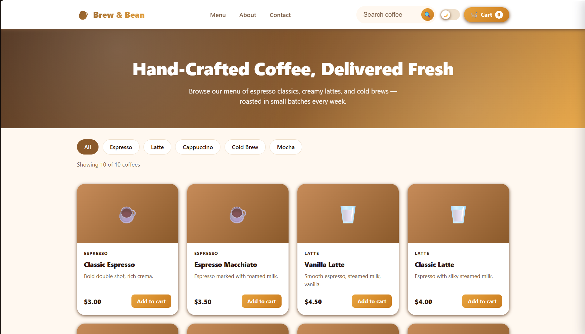
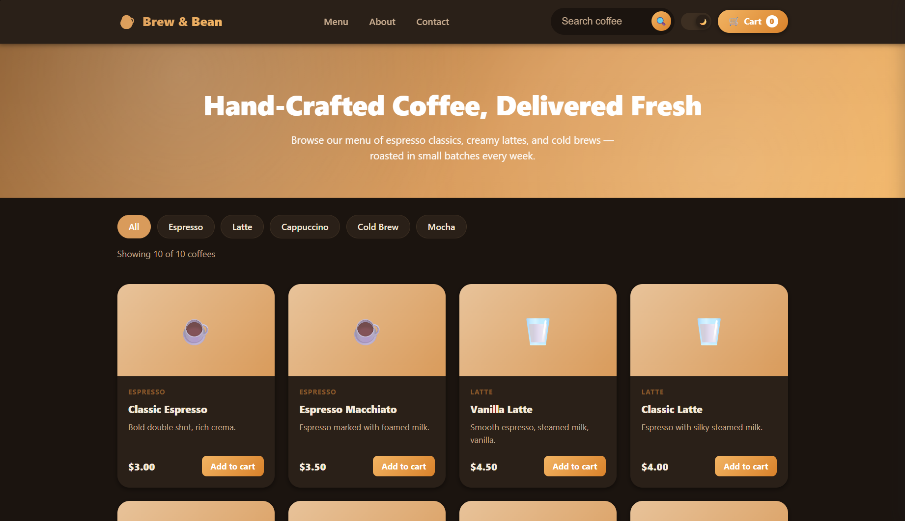
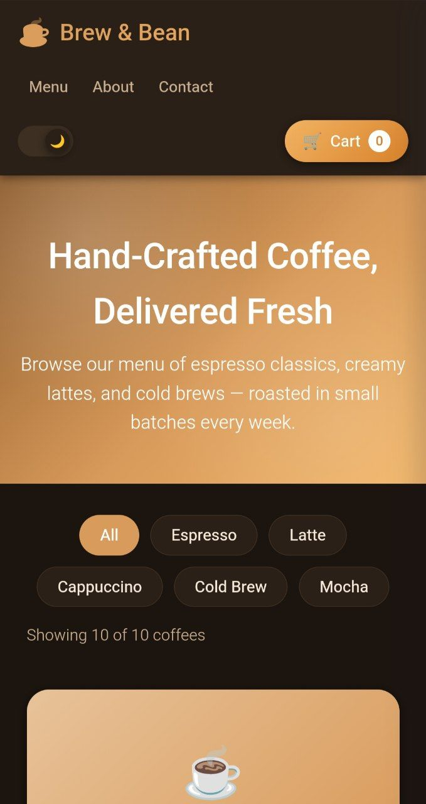

# Brew & Bean ☕

A modern, fully responsive coffee shop web application built with **HTML**, **CSS**, and **Vanilla JavaScript**.

Brew & Bean delivers a premium café-inspired experience featuring dynamic product browsing, intelligent search, category filtering, shopping cart functionality, and seamless Light/Dark Mode support. The project was created to demonstrate modern frontend development practices, responsive design principles, and user-focused interface implementation.

---

## 🚀 Live Demo

🔗 https://brew-and-bean.netlify.app

---

## ✨ Features

### User Experience

* ☕ Modern coffee shop interface
* 🌙 Dark / Light Mode toggle
* 📱 Fully responsive design
* 🔍 Product search functionality
* 🛒 Interactive shopping cart
* 🎯 Category filtering
* ⚡ Smooth interactions and transitions
* ♿ Accessible and semantic HTML structure

### Responsive Design

Optimized for:

* Mobile Devices
* Tablets
* Laptops
* Desktop Screens

The layout automatically adapts to different screen sizes while maintaining usability and visual consistency.

---

## 📸 Screenshots

### ☀️ Light Mode

<p align="center">
  
</p>

<p align="center">
  Modern coffee shop interface with product browsing, filtering, and cart functionality.
</p>

---

### 🌙 Dark Mode

<p align="center">
  
</p>

<p align="center">
  Fully integrated dark theme designed for improved accessibility and comfortable viewing.
</p>

---

### 📱 Mobile Experience

<p align="center">
  
</p>

<p align="center">
  Responsive mobile layout optimized for smaller screens and touch interactions.
</p>

---

## 🛠️ Built With

### Frontend

* HTML5
* CSS3
* JavaScript (ES6+)

### Concepts & Techniques

* Responsive Design
* Flexbox
* CSS Grid
* Mobile-First Principles
* DOM Manipulation
* Theme Switching
* Dynamic Filtering
* Interactive UI Components

---

## 📂 Project Structure

```text
Coffee-Shop/
│
├── assets/
│   ├── images/
│   └── icons/
│
├── screenshots/
│   ├── home-light.png
│   ├── home-dark.png
│   └── mobile-view.png
│
├── index.html
├── style.css
├── script.js
└── README.md
```

---

## 🎯 Project Goals

This project was built to improve and demonstrate:

* Frontend Development Skills
* Responsive Web Design
* JavaScript Functionality
* User Interface Design
* Git & GitHub Workflow
* Project Deployment
* Real-World Portfolio Development

---

## 🔮 Future Improvements

* Product detail pages
* Wishlist functionality
* User authentication
* Backend integration
* Online ordering system
* Payment gateway integration
* Order history
* Product reviews and ratings
* Performance optimization

---

## 👨‍💻 Author

### Ended Anderson

Independent Developer & Frontend Learner

**GitHub:**
https://github.com/EndedAndersonofficial

Passionate about building modern web experiences, exploring new technologies, and continuously improving through real-world projects.

---

## 📄 License

This project is intended for educational and portfolio purposes only.

---

### ⭐ If you found this project interesting, consider giving it a star.
